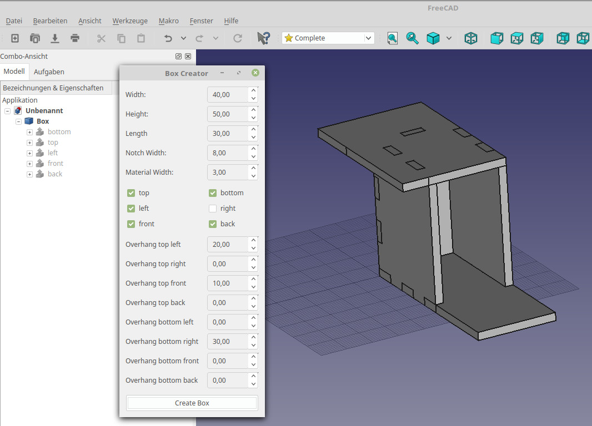
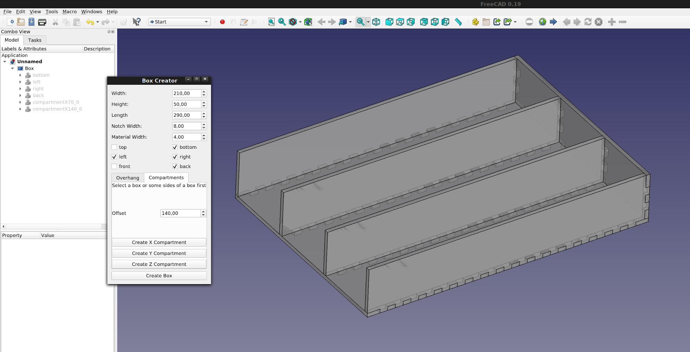

# FreeCAD Box Creator Macro

Creates a box with interlocked notches.

## Installation
In menu Tools select Addon Manager
Select the Macros tab
find Boxcreator in the list and click Install

In menu Macro select Macros...
Execute boxcreatorGUI.py

### Manual Installation
Copy the .py files to your FreeCAD Macro directory (on Linux: ~/.FreeCAD/Macro)

## Support for Compartments
