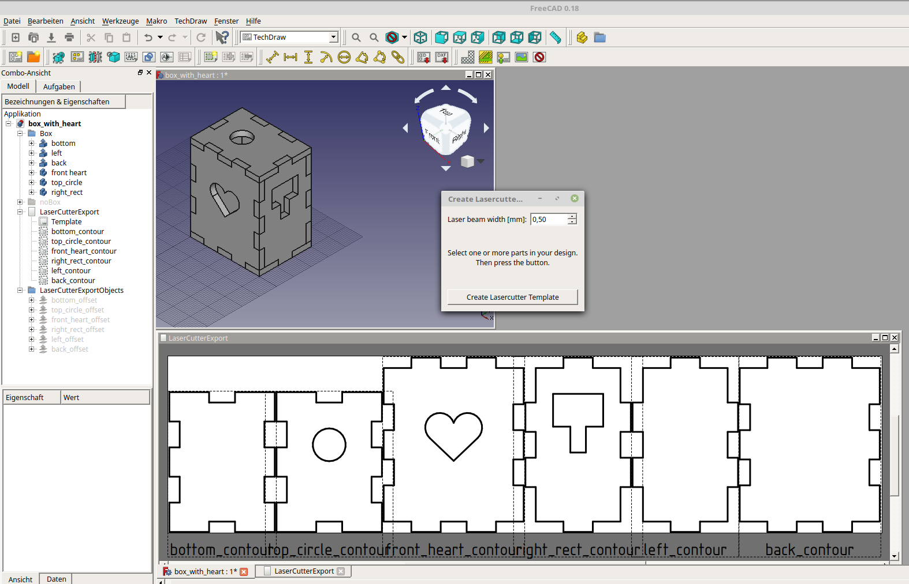

# FreeCAD Lasercutter SVG Export Macro

We have a lasercutter that uses .svg files as input.  
I would like to generate .svg files from my FreeCAD designs.  
The laser beam width has to be considered, but I do not want to add it in my design.  

I have created a script that is doing this task:

* Select several parts in the FreeCAD design
* Create 3D outline objects from all selected items
* Rotate them into the XY-plane
* Create views in a TechDraw page
* Arrange the views to fit in the page with minimal gaps

## Installation
In FreeCAD, select the Addon manager from tools menu. Go to the Macros tab and find LasercutterSVGExport in the list. Click Install.  

or  
Copy LasercutterSVGExport.FCMacro to your FreeCAD Macro directory (on Linux: ~/.FreeCAD/Macro)  
In menu Macro select Macros...  
Execute LasercutterSVGExport.FCMacro 

## Usage
* Select one or more parts in your FreeCAD design
* Execute the macro
* Enter the width of your lasercutters laser beam
* Click Create Lasercutter Template
* Open the TechDraw page "LaserCutterExport"
* Repeat this procedure for additional parts. New parts will be placed on top of the old ones.
* In the TechDraw workbench, select Export page as SVG

## Discussion
[Dedicated FreeCAD forum discussion thread](https://forum.freecadweb.org/viewtopic.php?f=35&t=31869)

## License
GNU Lesser General Public License v3.0

